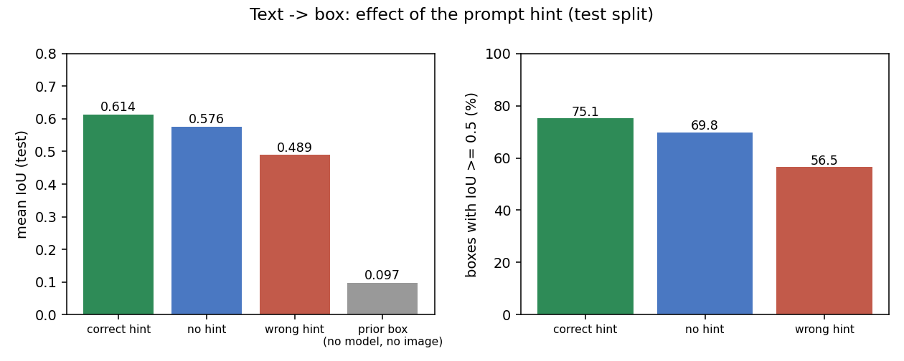
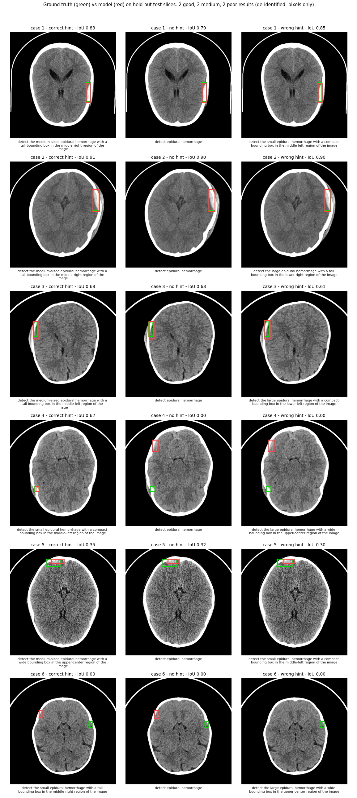
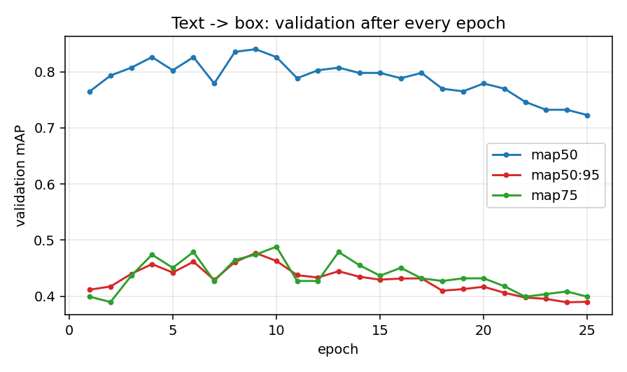
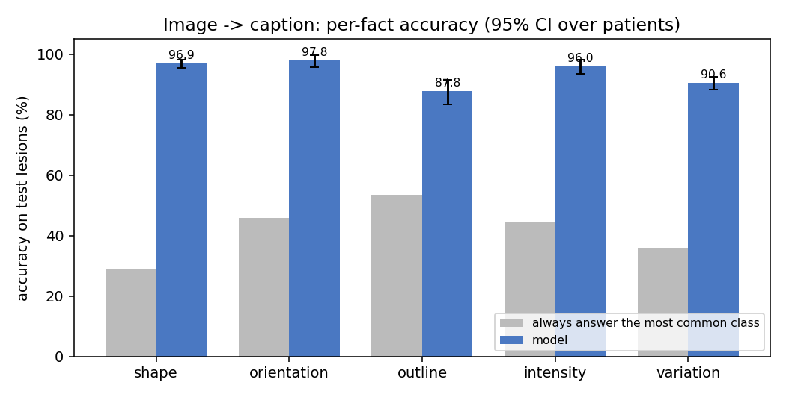
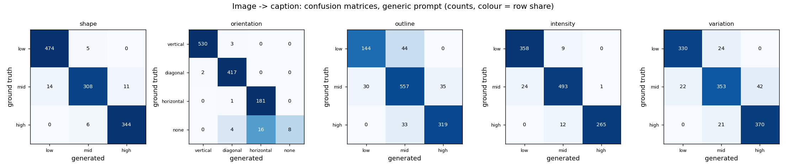
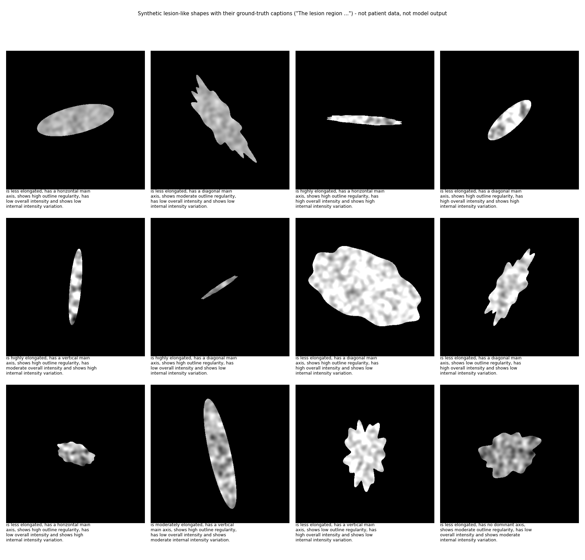

# PaliGemma 2 for lesion localisation (text → box) and lesion captioning (image → text)

One vision-language model family, two fine-tuned functions, on brain CT slices with epidural hemorrhage:

| | input | output | code |
|---|---|---|---|
| **Text → box** (visual grounding) | slice + a text prompt, e.g. *"detect the small epidural hemorrhage with a compact bounding box in the middle-right region of the image"* | one bounding box as `<loc>` tokens | [`detection/`](detection) |
| **Image → caption** | a lesion-only crop + *"Describe the visible characteristics of this epidural hemorrhage."* | *"The lesion region is less elongated, has a vertical main axis, shows high outline regularity, …"* | [`captioning/`](captioning) |

Both fine-tune [`google/paligemma2-3b-pt-448`](https://huggingface.co/google/paligemma2-3b-pt-448) with LoRA (rank 8, bf16, gradient checkpointing) using the [maestro](https://github.com/roboflow/maestro) trainer as a library, plus the fixes and extras in [`common/`](common).

> **This is a research/engineering project, not a medical device.** Captions are objective *visual measurements* of the lesion
> (elongation, direction, outline regularity, brightness, texture variation), not diagnoses or clinical findings.
> **No dataset and no model weights are included in this repository** (see [Data](#data)). The only patient-derived pixels are the
> six de-identified held-out test slices in `results/detection_boxes_by_prompt.png` (pixels only; no names, identifiers or metadata),
> shown to illustrate the box outputs; all other pictures are charts or synthetic shapes.

## Results (held-out test patients)

Splits are **by patient** (train 55 / validation 7 / test 17 patients), so a test patient is never seen in training.

### Text → box (1,138 test lesions)
The model is trained with prompts that describe the lesion's size / shape / region. Three prompt situations are compared on the same test images:

| prompt at test time | mean IoU | boxes with IoU ≥ 0.5 | mAP@50 |
|---|---|---|---|
| correct size + shape + region hint | **0.614** | 75.1% | 0.599 |
| no hint (`detect epidural hemorrhage`) | 0.576 | 69.8% | 0.537 |
| deliberately wrong hint | 0.489 | 56.5% | 0.352 |
| no model, no image (mean training box for the hint) | 0.097 | 0.7% | – |

* The correct hint beats no hint by **+0.038 IoU** (95% CI over patients +0.015 … +0.063): real, but small. It helps on ~41% of test lesions, hurts on ~22%.
* The model reads the image, it does not just follow the text: with a wrong hint it still outputs the image's true region 76.7% of the time (the wrong prompt's region only 5.3%). A wrong *size* word is followed more often (36.0%) and can break the answer.
* **The hint is built from the ground-truth box (an oracle).** On a new image nobody knows it, so the *no-hint* row is the realistic number.
* Two of the 17 test patients get almost no correct boxes whatever the prompt; per-patient results are in [`results/detection_test_summary.txt`](results/detection_test_summary.txt).



*Six held-out test slices, one per patient, de-identified (pixels only, no names or metadata), chosen by result quality: 2 good, 2 medium, 2 poor (IoU with the correct hint ≥ 0.7, 0.4–0.7, < 0.4), restricted to brain-level slices. Green = ground truth, red = model.*

Validation mAP peaked around epoch 9–10 and then slowly declined (over-fitting), so the epoch-10 snapshot (best on *validation*) was used for the test:


### Image → caption (1,162 test lesions, 17 patients)
Every caption states five facts; accuracy is per fact, compared with "always answer the most common training class":

| fact | model | 95% CI (patients) | majority-class baseline |
|---|---|---|---|
| shape (less / moderately / highly elongated) | **96.9%** | 95.4 – 98.1 | 28.7% |
| main-axis direction | **97.8%** | 95.7 – 99.7 | 45.9% |
| outline regularity | **87.8%** | 83.3 – 91.5 | 53.5% |
| overall intensity | **96.0%** | 93.5 – 98.1 | 44.6% |
| internal intensity variation | **90.6%** | 88.3 – 92.5 | 35.9% |

* 71.9% of generated captions are word-for-word identical to the reference; on average 4.69 of 5 facts are right, and on the four ordered facts (shape, outline, intensity, variation) every wrong answer is exactly one level off (low↔mid↔high). For direction, most errors are the rare "no dominant axis" class.
* Label combinations never seen in training: 88.0% mean per-fact accuracy (n = 15) vs 93.9% for seen ones.
* Weak spots: outline regularity and internal variation (values near the level boundaries), and the rare "no dominant axis" class (8 of 28 right).
* ROUGE-L 0.987 / BLEU-4 0.965 against the reference are reported by the evaluation but are **not informative** for templated captions: a fake model that always answers the majority class also scores ROUGE-L ≈ 0.88 with 0% fully-correct captions. Judge by the per-fact numbers.
* The reference captions are *computed from measurements of the lesion*, so this task is close to "learn to measure"; it is not radiological report generation.




Anonymised text examples (ground truth vs generated, wrong clause marked): [`results/captioning_examples.md`](results/captioning_examples.md).
Because real lesion images cannot be published, the caption *format* is illustrated on synthetic shapes (ground-truth captions from the real measurement code, not model output):


## Repository layout
```
detection/    text -> box:  build_prompt_dataset.py  audit_prompts.py  train_detection.sh / train_paligemma_python.py
              evaluate_prompts.py (test protocol)  evaluate_validation.py  test_one_image_prompts.py
captioning/   image -> caption:  build_captioning_dataset.py  build_lesion_only_variant.py  build_bundle_dataset.py
              training/{train_paligemma_captioning,evaluate_captioning,infer_paligemma_captioning,compare_captions,caption_bundle,caption_metrics}.py
              demo_synthetic_lesions.py (no data needed)
common/       shared training code: resume/checkpoint callbacks, warm-up+cosine schedule, LoRA-dropout patch, augmentation, mAP metric
scripts/      run_detection.sh, run_captioning.sh (convenience wrappers), make_result_figures.py (private outputs -> shareable results)
tests/        test_no_data.py (synthetic, CPU only)
results/      charts, box drawings on six de-identified test slices, anonymised summaries
docs/         data_format.md, detection.md, captioning.md
```

## Setup
```bash
pip install -r requirements.txt
huggingface-cli login            # accept the Gemma licence for google/paligemma2-3b-pt-448 first
python tests/test_no_data.py     # data-free sanity tests (CPU)
python captioning/demo_synthetic_lesions.py --num_images 12   # see what the caption labels look like
```
Trained on 2 × 24 GB GPUs (batch 1 × 8 accumulation per GPU, ≈ 22 min/epoch). See [docs/data_format.md](docs/data_format.md) for the data you have to provide.

## Quick start
```bash
# text -> box
cd detection
python build_prompt_dataset.py --coco_dir ../data/annotations --images_dir ../data/images
GPUS=0,1 EPOCHS=25 ./train_detection.sh
# evaluate the epoch-10 snapshot on the test split (2 GPUs, then aggregate)
for s in 0 1; do CUDA_VISIBLE_DEVICES=$s python evaluate_prompts.py --adapter_dir $PWD/training_output/1/checkpoints/epoch_010 \
   --split test --shard $s --num_shards 2 --conditions matched,baseline,mismatched --out_prefix eval & done; wait
python evaluate_prompts.py --aggregate --split test --out_prefix eval
# one image, many prompts (which prompt works best for this image?)
python test_one_image_prompts.py --adapter_dir $PWD/training_output/1/checkpoints/epoch_010 --images <image>.png

# image -> caption
cd ../captioning
python build_captioning_dataset.py --coco_dir ../data/annotations --images_dir ../data/images --masks_dir ../data/masks
python build_lesion_only_variant.py && python build_bundle_dataset.py
CUDA_VISIBLE_DEVICES=0,1 python training/train_paligemma_captioning.py --config training/config_bundle.yaml
python training/evaluate_captioning.py --adapter_dir <abs path to epoch_015> --split test --shard 0 --num_shards 2   # + shard 1, then --aggregate
python training/compare_captions.py --split test          # generated vs ground-truth, every test lesion
```
`scripts/run_detection.sh` and `scripts/run_captioning.sh` chain these steps (convenience only; the individual steps are what was run).

## Design notes that mattered
* **Append `<eos>` to every target.** Without it the model never learns to stop and repeats boxes.
* **`<loc>` boxes are `y1 x1 y2 x2` in 1/1024 bins of the image size**, so decode with the *true* image height/width (a bug that decoded some non-square images as 512 × 512 understated one patient's IoU until fixed; a regression test is in `tests/`).
* **Prompts must be true for the box they describe** (`detection/audit_prompts.py` checks every prompt); augmentation regenerates the prompt from the augmented box.
* **Split by patient**, never by slice (neighbouring slices are near-duplicates).
* **Captioning: each fact is learned separately.** Every training draw asks about a random subset of the five facts; flips/rotations are applied and *every fact is re-measured on the augmented image*, so a vertical lesion rotated by 90° is captioned "horizontal". This handles the 324 possible label combinations, most of them rare.
* Gemma 2 forces eager attention (soft-capping), bf16 + gradient checkpointing is needed to fit 24 GB, and maestro's LoRA dropout (0.05) is patched to 0.1 after loading.

## Limitations
Small data (79 patients, near-duplicate consecutive slices → wide patient-level confidence intervals); the detection hint is an oracle; the caption labels are threshold-based (terciles fitted on the training set) so errors concentrate at level boundaries; no clinical validation; PNG grey values are not Hounsfield units and directions are image directions, not anatomical.

## Data
The dataset is not included and not redistributable (apart from the six de-identified slices above). The code expects COCO annotations, PNG slices and (for captioning) binary lesion masks; see [docs/data_format.md](docs/data_format.md). Model weights are not published either.

## License
The code in this repository is released under the [MIT License](LICENSE). The MIT licence covers this repository's code only:
the base model `google/paligemma2-3b-pt-448` is subject to the [Gemma terms of use](https://ai.google.dev/gemma/terms), the
[maestro](https://github.com/roboflow/maestro) trainer and other dependencies keep their own licences, and the clinical data this work
was developed on is not part of the repository and is not licensed for redistribution.
